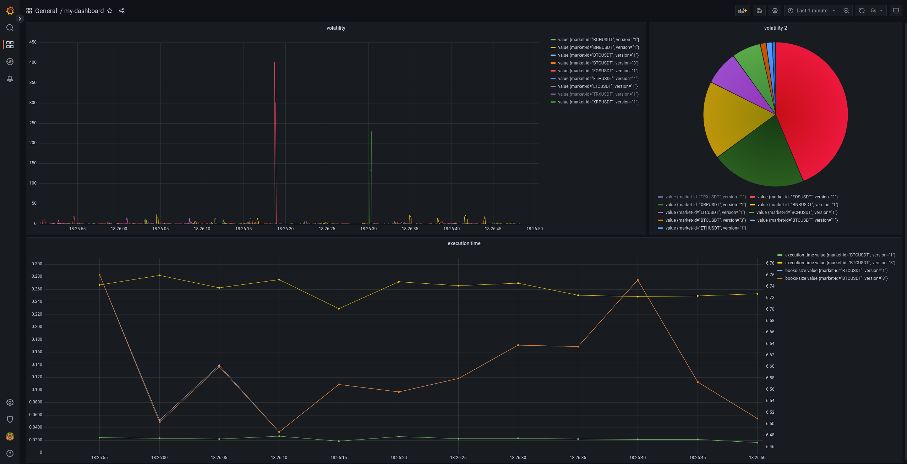

# volatility-service


## running...

### ...in Docker with visualization in Grafana
Requires `docker-compose`.

step 1:
```
sudo chown -R 472:472 volumes/grafana/
docker-compose up -d
```
step 2:

Look in the logs or go to http://localhost:3000 and log in with `admin`/`password`.

### ...tests
Requires `node` and `rust`.
```
cd service
npm install
npm run test
```

## TODO
multiple markets
